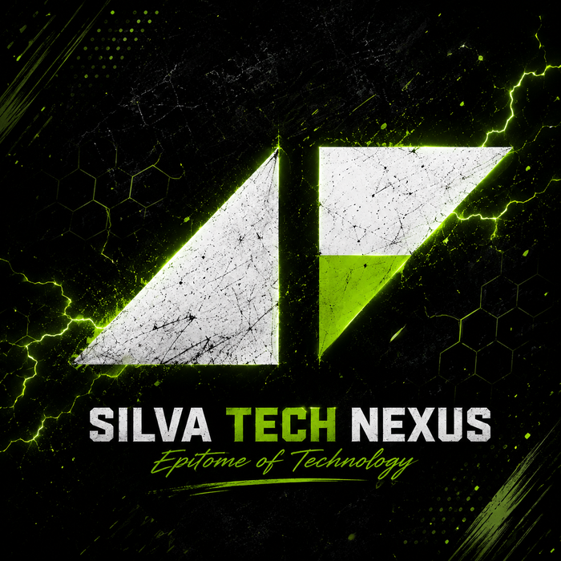
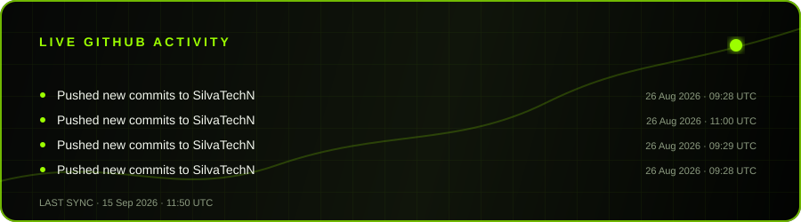

  

  # SILVA TECH NEXUS

  **Technology with a pulse. Ideas with direction.**

  

    I’m SilvaTechN — exploring software, systems, and bold digital experiences
    that turn interesting ideas into useful things.
  

  

    
    
    
  

 

## `01` / THE SIGNAL

> **Build clearly. Learn constantly. Ship intentionally.**

I like working where creativity meets engineering: shaping clean interfaces,
learning new tools, and turning rough concepts into experiences people can
actually use.

### What I’m focused on

- Designing practical software with a distinct point of view
- Growing a reliable, modern developer toolkit
- Learning in public through experiments and shipped projects
- Collaborating with curious people who care about the details

## `02` / THE TOOLBOX

  
  
  
  
  
  

  My stack evolves with the problem. The goal is always the same: useful, maintainable work.

## `03` / LIVE ACTIVITY

<!--
  This image is generated by .github/workflows/update-profile.yml.
  GitHub scheduled workflows have a practical five-minute minimum cadence;
  the workflow is intentionally configured to refresh as often as GitHub allows.
  If the public API is unavailable, the last good card is kept in place.
-->

  

## `04` / BUILD PHILOSOPHY

<table>
  <tr>
    <td width="33%" valign="top">
      <strong>01 — Clarity</strong> 
      Make the complex feel approachable and the important impossible to miss.
    </td>
    <td width="33%" valign="top">
      <strong>02 — Craft</strong> 
      Small details compound. Thoughtful structure makes future work faster.
    </td>
    <td width="33%" valign="top">
      <strong>03 — Momentum</strong> 
      Learn, prototype, ship, listen, and keep moving with intention.
    </td>
  </tr>
</table>

## `05` / CONNECT

Have an idea worth building, a useful problem to solve, or a project that
could use another perspective? **Open an issue or start a conversation on
[GitHub](https://github.com/SilvaTechN).**

   
  
    
  © Silva Tech Nexus · Built with curiosity and a little neon.

